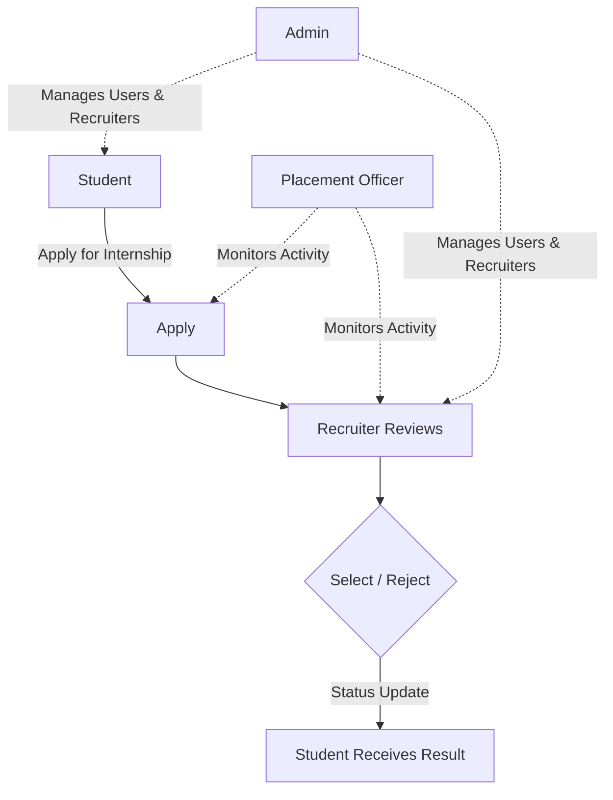
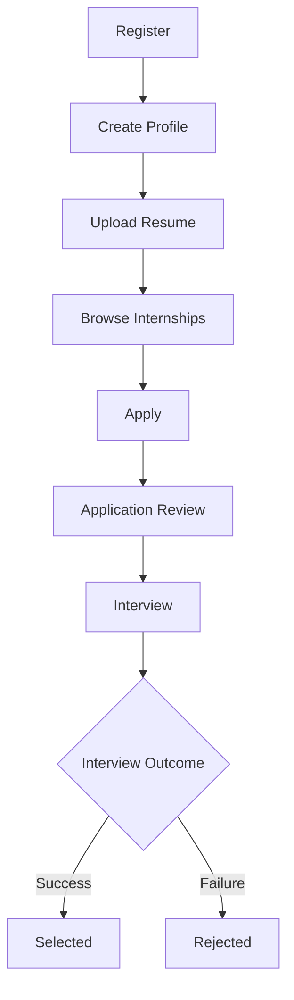
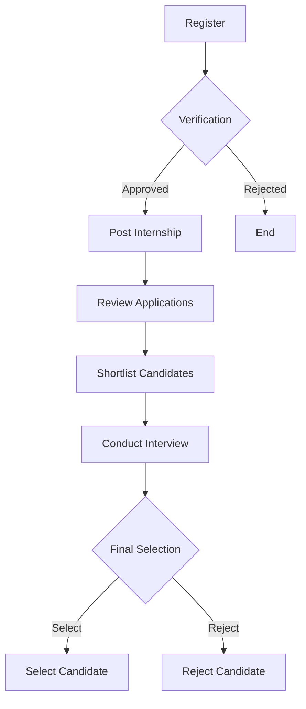
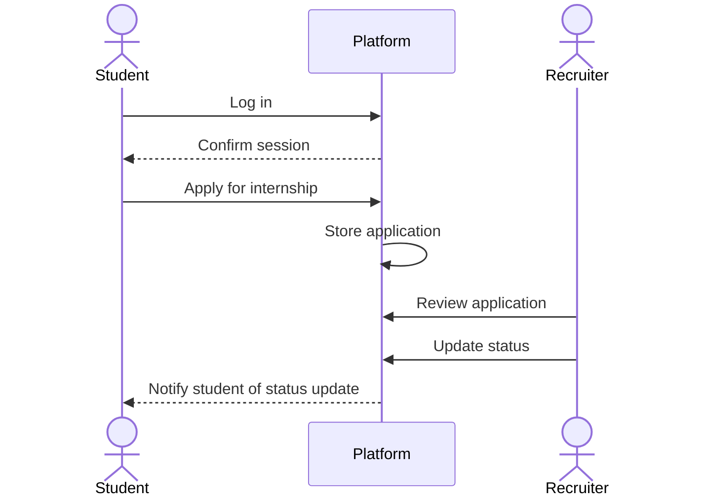

# Internship Management Platform Workflows

This document contains the core workflow diagrams and sequence diagrams for the Internship Management Platform using Mermaid syntax.

---

## 1. System Overview Flowchart

This flowchart illustrates the high-level interactions between the Student, Recruiter, Placement Officer, and Admin. The Placement Officer monitors the overall placement process, while the Admin manages system users and recruiters.

---

## 2. Student Application Workflow

This diagram outlines the step-by-step workflow for a student, from initial registration to the final selection or rejection outcome.

---

## 3. Recruiter Workflow

This flowchart details the recruiter lifecycle, showing the mandatory verification check after registration and the decision logic for the final candidate selection.

---

## 4. System Sequence Diagram

This sequence diagram displays the chronological messages exchanged between the Student, Platform, and Recruiter during the application and review cycle.

