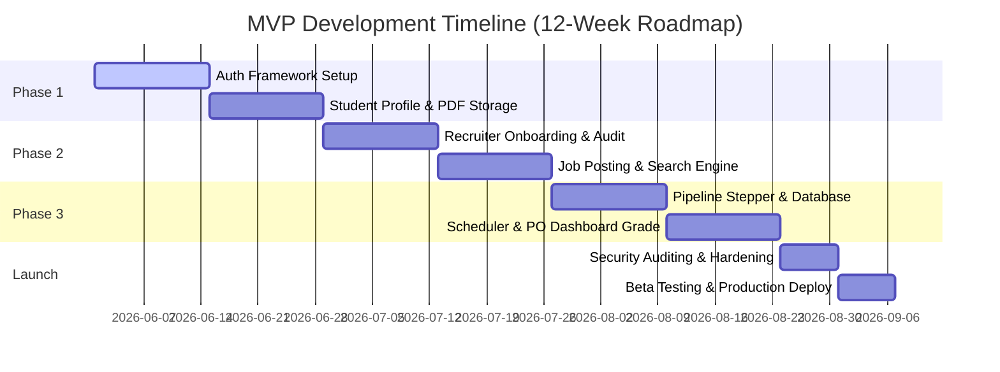

# Minimum Viable Product (MVP) Definition

This document establishes the product definition, core goals, functional scope boundaries, success metrics, user acceptance criteria, and development roadmap for the **Internship Management Platform** MVP.

---

## 1. MVP Goal

The primary goal of the MVP is to deliver a secure, centralized, and reliable web-based portal that connects Students, Recruiters, and Placement Officers. By replacing manual email-and-spreadsheet workflows, the MVP aims to automate job posting, application submission, resume access, and candidate tracking, laying the groundwork for digital transformation in academic placements.

---

## 2. MVP Scope

The MVP focuses on the absolute minimum functionality required to execute a complete internship placement cycle safely. This includes user onboarding, resume hosting, job publishing, screening candidate submissions, and recording hiring results. Advanced analytics, automated AI grading, and third-party integrations are explicitly kept out of scope to focus on a rapid, secure core release.

---

## 3. Included Features (In-Scope)

### Authentication
* **Description**: Secure, token-based login and registration for Students, Recruiters, and Placement Officers.
* **Scope Limits**: Access restricted to institutional email domains for students and verified business emails for recruiters. Basic secure login session management.

### Student Profiles
* **Description**: Custom profile screens where students can list academic credentials, GPA, graduation dates, and core skill tags.
* **Scope Limits**: Plain text inputs with database persistence; profile pictures are not supported in the initial MVP.

### Resume Upload
* **Description**: Direct upload of student resumes onto secure backend cloud storage.
* **Scope Limits**: Restricts document types to PDF only. The system enforces a file size ceiling of 5MB.

### Internship Posting
* **Description**: A form-based tool for verified recruiters to draft and publish internship openings.
* **Scope Limits**: Requires manual Placement Officer review and approval before job listings become live to candidates.

### Internship Search
* **Description**: Search and filtering system for active student candidates to explore job opportunities.
* **Scope Limits**: Filtering matches by technical skills, location constraints, and minimum stipend values.

### Applications
* **Description**: A one-click mechanism allowing students to submit their profiles and attached PDF resumes to specific job posts.
* **Scope Limits**: Students can submit only one application per posting.

### Application Tracking
* **Description**: Live, step-by-step pipeline view tracking the status of candidates.
* **Scope Limits**: Standard application state transitions: `Applied` $\rightarrow$ `Shortlisted` $\rightarrow$ `Interviewing` $\rightarrow$ `Selected/Rejected`.

### Recruiter Dashboard
* **Description**: A consolidated panel displaying active recruiter job postings, applicant counts, and pipeline Kanban categories.
* **Scope Limits**: Simple overview layout with quick action triggers to transition candidates or set interview dates.

---

## 4. Excluded Features (Out-of-Scope)

The following capabilities are excluded from the MVP to control scope creep and guarantee high performance on core pathways.

* **AI Resume Analysis**: Auto-parsing resume texts or utilizing AI to grade candidate resumes is excluded. Resumes will be read manually by recruiters.
* **Recommendation Engine**: Automated "smart matches" connecting students to job posts using algorithmic scoring are excluded. Search remains purely query-driven.
* **Video Interviews**: Direct web-RTC video or audio calls hosted natively on the platform are excluded. Recruiters will generate and insert external meeting links (Zoom/Google Meet).
* **Chat System**: Real-time peer-to-peer chat between students and recruiters is excluded. Communication relies on email notifications and dashboard updates.
* **Analytics Dashboard**: Complex graphical charts, custom business intelligence models, and custom placement dashboards are excluded. Basic monitoring relies on simple database query counts.

---

## 5. MoSCoW Prioritization Table

The product features are structured into four priority groups to guide engineering sprint planning:

| Priority | Feature / Capability | Module | MVP Status |
| :--- | :--- | :--- | :--- |
| **Must Have** | Multi-Role Authentication | Auth | **Included** |
| **Must Have** | Student Profile & Skills Setup | Student | **Included** |
| **Must Have** | PDF Resume Upload ($\le$ 5MB) | Student | **Included** |
| **Must Have** | Internship Posting Creation | Recruiter | **Included** |
| **Must Have** | Internship Search & Filters | Student | **Included** |
| **Must Have** | Single-Click Job Application | Student | **Included** |
| **Must Have** | Status Stepper Pipeline | Student / Recruiter| **Included** |
| **Must Have** | Recruiter Verification Console | Placement Officer | **Included** |
| **Should Have**| Password Self-Service Recovery | Auth | **Included** (Subject to time) |
| **Should Have**| External Interview Scheduler | Recruiter | **Included** (Simplistic model)|
| **Should Have**| Student Selection Scorecard | Recruiter | **Included** (Required for grades) |
| **Should Have**| basic PO Monitoring Board | Placement Officer | **Included** (Simple counters) |
| **Could Have**| Departmental Excel Exports | Placement Officer | *Excluded* (Drafted for Phase 2) |
| **Could Have**| System Storage Alert Warnings | Admin | *Excluded* (Drafted for Phase 2) |
| **Won't Have** | AI Resume Skill Matching | Analytics | *Excluded* (Future Roadmap) |
| **Won't Have** | Direct Video Interview Interface| Recruiter | *Excluded* (Future Roadmap) |
| **Won't Have** | Direct Student Chat Channel | Messaging | *Excluded* (Future Roadmap) |

---

## 6. Effort Estimation Table

The estimated engineering efforts for building the core modules of the Internship Management Platform MVP:

| Module / Epic | Complexity | Estimated Story Points | Estimated Developer Hours | Focus Phase |
| :--- | :---: | :---: | :---: | :---: |
| **Auth & Security Framework** | Medium | 5 | 40 | Phase 1 |
| **Student Profiles & Resume DB**| Medium | 5 | 48 | Phase 1 |
| **Recruiter Onboarding & Verify**| High | 8 | 64 | Phase 2 |
| **Internship Posting & Moderation**| Medium | 5 | 40 | Phase 2 |
| **Job Search & Query Engine** | Low | 3 | 24 | Phase 2 |
| **Application & Pipeline Stepper**| High | 8 | 72 | Phase 3 |
| **Interview Scheduler Module** | Medium | 5 | 48 | Phase 3 |
| **PO Dashboard & Gradebook Console**| Medium | 5 | 40 | Phase 3 |
| **Admin Controls & Security Audit**| Low | 3 | 24 | Phase 3 |
| **System Testing & Deployment** | Medium | -- | 40 | Launch |
| **TOTAL** | -- | **47 SP** | **440 Hours** | -- |

---

## 7. Success Metrics

To validate the viability of the MVP post-release, the university will track the following key performance indicators (KPIs):

### Adoption Metrics
* **Student Registration Rate**: $\ge 85\%$ of the eligible final-year university cohort registered within 2 weeks of launch.
* **Recruiter Engagement**: $\ge 30$ verified employers onboarded and posting listings in the first active cycle.

### Operational Efficiency
* **Time-to-Placement**: Reduction in average placement process cycle time from 28 days (manual spreadsheets) to under 12 days.
* **Application Throughput**: Average number of applications processed per recruiter increased by $\ge 40\%$ due to centralized resume accessibility.

### System Quality
* **App Uptime**: $\ge 99.5\%$ system availability maintained during peak university recruitment weeks.
* **API Responsiveness**: Core endpoints (profile search, application submit) maintain response times under 500ms.

---

## 8. User Acceptance Criteria (UAC)

The MVP is accepted for launch only when it meets the following standards:

* **UAC-AUTH-01**: A user registering with an address ending in `@gmail.com` must be blocked from selecting the "Student" role and prompted to use their university domain.
* **UAC-FILE-02**: The platform must reject a 6MB resume file and a 1MB DOCX file, showing an explicit warning. It must successfully write and store a 4.5MB PDF file.
* **UAC-ROLE-03**: A recruiter must only be able to view profiles and resumes of students who have explicitly applied to their active internship postings.
* **UAC-JOB-04**: An internship listing posted by a recruiter must remain invisible on the student job search feed until the Placement Officer activates the "Approved" toggle on their dashboard.

---

## 9. Development Roadmap

### Phase 1: Foundation (Weeks 1 to 4)
* **Goal**: Build core authentication and user storage architectures.
* **Deliverables**: Secure registration/login APIs, initial DB schemas, student profiles dashboard, and PDF resume upload integration.

### Phase 2: Engagement (Weeks 5 to 8)
* **Goal**: Establish the corporate side of the portal.
* **Deliverables**: Recruiter onboarding, Placement Officer verification panel, internship listing editor, and the student's advanced job search engine.

### Phase 3: Selection & Launch (Weeks 9 to 12)
* **Goal**: Finalize placement workflows, conduct testing, and deploy.
* **Deliverables**: Kanbans, interview schedulers, PO gradebooks, end-to-end integration tests, security audits, and production launch.
