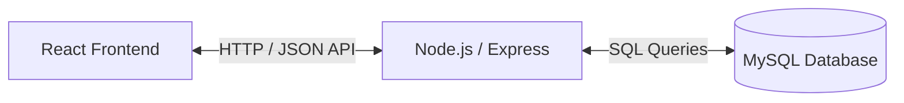

# Software Requirements Specification (SRS)
## Internship Management Platform

**Version:** 1.0  
**Date:** June 2, 2026  
**Status:** Draft  

---

### Table of Contents
1. [Introduction](#1-introduction)
2. [Problem Statement](#2-problem-statement)
3. [Objectives](#3-objectives)
4. [Scope](#4-scope)
5. [User Roles](#5-user-roles)
6. [Functional Requirements](#6-functional-requirements)
7. [Non-Functional Requirements](#7-non-functional-requirements)
8. [Technology Stack](#8-technology-stack)
9. [System Architecture Overview](#9-system-architecture-overview)
10. [Assumptions and Constraints](#10-assumptions-and-constraints)
11. [Future Enhancements](#11-future-enhancements)
12. [Conclusion](#12-conclusion)

---

### 1. Introduction
This document outlines the software requirements for the **Internship Management Platform**. The platform is designed to connect Students, Internship Coordinators, and Employers to manage student internships from application to final evaluation.

---

### 2. Problem Statement
Currently, managing student internships involves manual processes, including spreadsheets, unstructured emails, and offline coordination. This makes it difficult to track applications, communicate updates, and evaluate student performance in a centralized and secure manner.

---

### 3. Objectives
* **Centralize Records:** Store all student, employer, application, and evaluation data in a single database.
* **Streamline Operations:** Make it easier and faster for students to apply to internships and for employers to screen candidates.
* **Track Evaluations:** Simplify how employer mentors rate interns and how coordinators assign final grades.

---

### 4. Scope
* **In-Scope:**
  * User registration and authentication.
  * Student profiles (resumes, skills, GPA).
  * Employer job postings.
  * Application tracking status changes (Applied, Shortlisted, Selected).
  * Performance evaluations and academic grading.
* **Out-of-Scope:**
  * Processing payments or payroll for student stipends.
  * Built-in video conferencing (relies on external links like Zoom/Google Meet).
  * Native iOS or Android applications.

---

### 5. User Roles
* **Student:** Creates a profile, uploads a resume, searches for internships, and submits applications.
* **Employer:** Posts internship listings, reviews applicants, updates recruitment status, and evaluates performance.
* **Coordinator:** Reviews and approves student profiles, approves job listings, and assigns academic grades.
* **Administrator:** Manages user accounts and performs basic system maintenance.

---

### 6. Functional Requirements
* **FR-1 Authentication:** Users must register and log in securely.
* **FR-2 Profile Management:** Students can create profiles and upload PDF resumes.
* **FR-3 Internship Postings:** Employers can post, edit, or close internship listings (pending coordinator approval).
* **FR-4 Application Tracking:** Students can apply to jobs, and employers can update the status (e.g., Shortlisted, Accepted, Rejected).
* **FR-5 Performance Evaluations:** Employers can submit a simple rating scorecard for active interns.
* **FR-6 Grading:** Coordinators can review employer evaluations and assign academic grades.
* **FR-7 Notifications:** In-app alerts notify users when application statuses change.

---

### 7. Non-Functional Requirements
* **Performance:** API response times should be under 500 milliseconds.
* **Security:** Passwords must be hashed. Data transmission must enforce HTTPS protocols.
* **Usability:** The web application interface must be fully responsive on desktop and mobile browsers.
* **Availability:** Target 99.5% uptime during active academic terms.

---

### 8. Technology Stack
* **Frontend:** React.js, HTML, CSS, JavaScript (Single Page Application).
* **Backend:** Node.js, Express.js (REST API).
* **Database:** MySQL (Relational Database Management System).

---

### 9. System Architecture Overview
The platform uses a standard **Three-Tier Architecture**:
1. **Presentation Layer:** React.js frontend interface.
2. **Application Layer:** Express.js and Node.js backend handles business logic.
3. **Data Layer:** MySQL database stores persistent tables (Users, Profiles, Jobs, Applications, Reviews).

---

### 10. Assumptions and Constraints
* **Assumptions:** Users have access to a stable internet connection and a modern web browser.
* **Constraints:** Budgetary limitations restrict document uploads to a maximum of 5MB per resume.

---

### 11. Future Enhancements
* **AI Matchmaking:** Automatically recommend jobs to students based on skills and resume contents.
* **Real-time Messaging:** Direct chat communication between employers and students.
* **Academic Credit Integration:** Automatically sync grades with the university's student information database.

---

### 12. Conclusion
The **Internship Management Platform** simplifies the coordination of academic internships. By providing a clean web portal built on React, Node.js, and MySQL, it reduces administrative work, improves transparency, and ensures data is managed securely.
