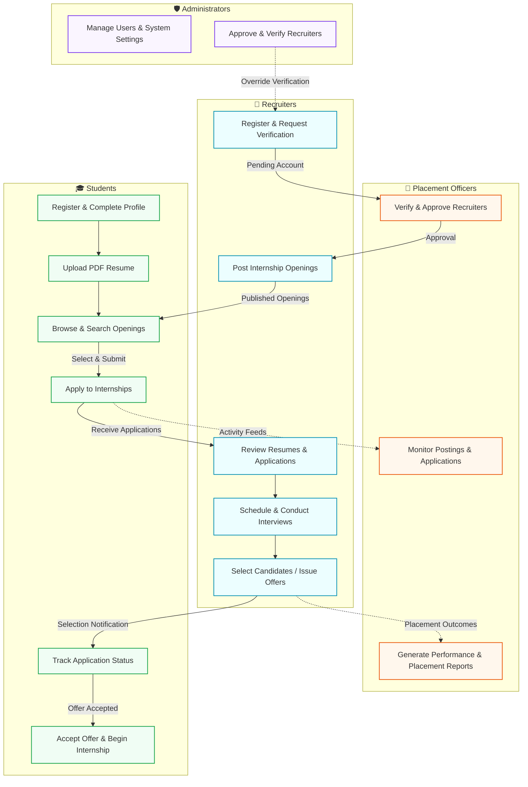
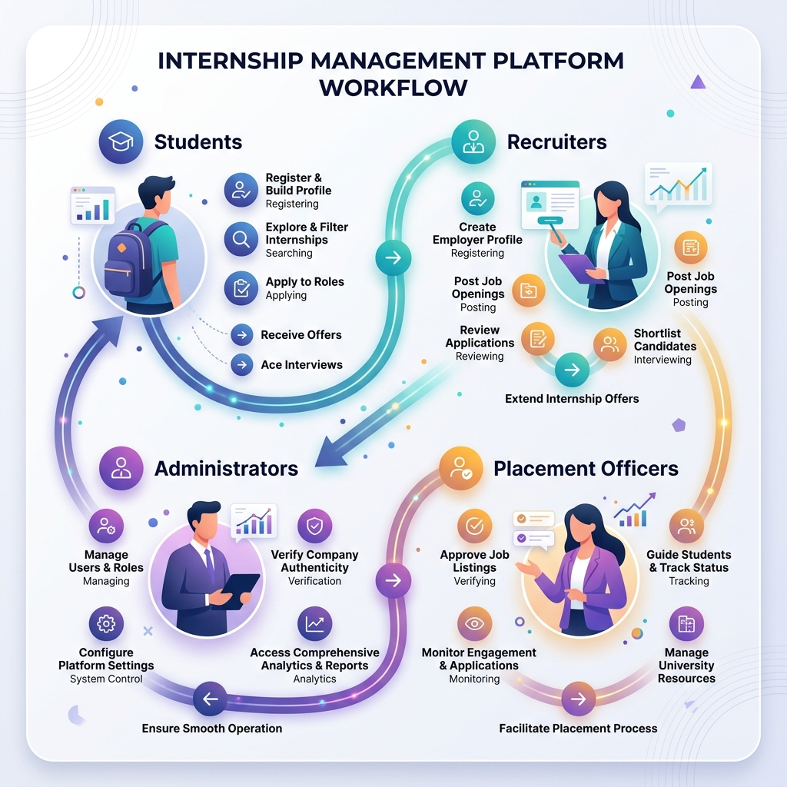
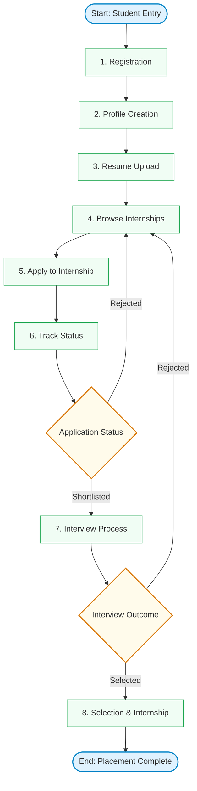
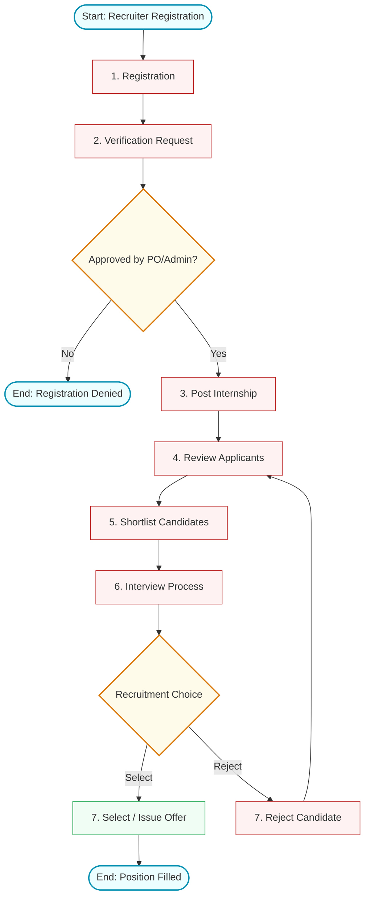
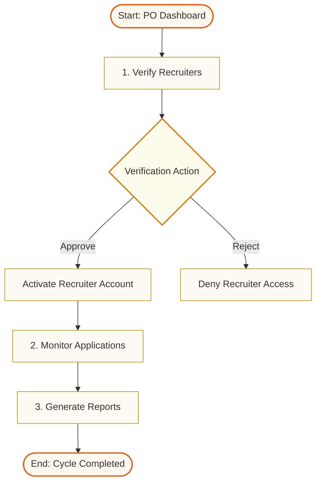
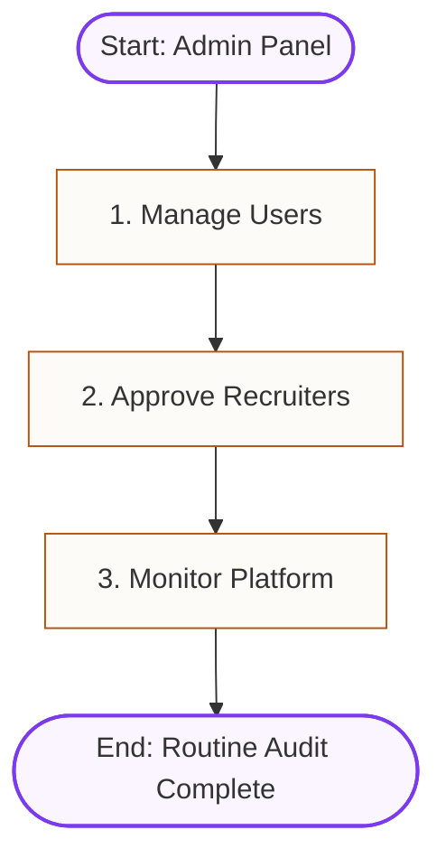

# System Workflow Overview

This document provides a comprehensive overview of the key workflows within the **Internship Management Platform**. It details the step-by-step processes for the four primary user roles: **Students**, **Recruiters**, **Placement Officers**, and **Administrators**.

## Master System Workflow

Below is the high-level interaction diagram showing how all four user roles securely interact and collaborate within the platform.

### Visual Workflow Infographic

Here is a visual presentation of the platform workflows and interactions:

---

## 1. Student Workflow

The Student Workflow outlines how candidates engage with the platform from their initial registration to tracking the final status of their applications.

### Workflow Diagram

### Detailed Steps

1. **Registration**: 
   Students register on the platform using their unique university-issued credentials. This guarantees that only enrolled and authorized students gain access to the internship search capabilities.
2. **Profile Creation**: 
   Once registered, students construct their digital profile. They input crucial academic details including current GPA, graduation year, core technical or business skills, and areas of interest.
3. **Resume Upload**: 
   Students upload their professional resume in PDF format. The system enforces strict security and file constraints (e.g., maximum file size of 5MB) to ensure system reliability and uniform storage.
4. **Browse Internships**: 
   Students can search, filter, and explore active job postings. They can filter opportunities based on domains, technologies, geographic location, stipend range, and duration.
5. **Apply**: 
   Upon finding a suitable internship, the student submits a formal application. This action creates a record connecting the Student's profile to the Recruiter's job post.
6. **Track Status**: 
   Students can monitor the real-time lifecycle of their applications (e.g., `Applied`, `Shortlisted`, `Under Interview Review`, or `Selected/Rejected`) directly via their dashboard notifications.

---

## 2. Recruiter Workflow

The Recruiter Workflow defines how employer representatives register, get verified, list vacancies, evaluate applicant profiles, and execute recruitment outcomes.

### Workflow Diagram

### Detailed Steps

1. **Registration**: 
   Recruiters sign up using their official corporate email addresses and provide key corporate identification details, such as company name, industry segment, and recruiter credentials.
2. **Verification**: 
   The recruiter account enters a pending state. It must undergo manual verification by either the Placement Officer or a System Administrator to prevent fraudulent accounts.
3. **Post Internship**: 
   Verified recruiters create detailed internship listings, defining roles and responsibilities, required skills, work location, compensation details, and applicant eligibility parameters.
4. **Review Applicants**: 
   Recruiters view the applicants' dashboard where they can read profile details, cross-reference skill matches, and download candidate resumes.
5. **Shortlist**: 
   Recruiters tag promising profiles as `Shortlisted`, signaling to students that their application has successfully cleared the initial screening phase.
6. **Interview**: 
   Recruiters organize and hold interviews. Since video calling is out-of-scope for the native system, external links (e.g., Zoom, Google Meet) are shared and logged within the system's scheduling module.
7. **Select/Reject**: 
   Based on interview performance, recruiters update the status to `Selected` or `Rejected`. The platform triggers instant notifications to candidates and Placement Officers.

---

## 3. Placement Officer Workflow

The Placement Officer (or Coordinator) serves as the primary operational authority, verifying external entities, monitoring placement statistics, and generating official analytics.

### Workflow Diagram

### Detailed Steps

1. **Verify Recruiters**: 
   Placement Officers perform background checks on newly registered recruiters, evaluating company credentials, websites, and job validity before granting backend access.
2. **Monitor Applications**: 
   Placement Officers supervise active internships, seeing total applicant numbers, monitoring which recruiters are actively hiring, and identifying students who have yet to secure placements.
3. **Generate Reports**: 
   Placement Officers compile and export statistical reports detailing overall placement percentages, performance reviews submitted by employers, and student eligibility.

---

## 4. Admin Workflow

Administrators control the core system stability, manage permissions, resolve system exceptions, and audit global platform activities.

### Workflow Diagram

### Detailed Steps

1. **Manage Users**: 
   Administrators oversee all user roles, resolve credential resets, deactivate accounts violating policies, and re-assign roles when university staff changes occur.
2. **Approve Recruiters**: 
   Administrators retain secondary/override approval rights on recruiters to support the placement officer staff during high-volume recruitment cycles.
3. **Monitor Platform**: 
   Administrators track total storage consumption (resumes), monitor API response metrics, and check background logs to ensure the system is operating optimally and securely.
